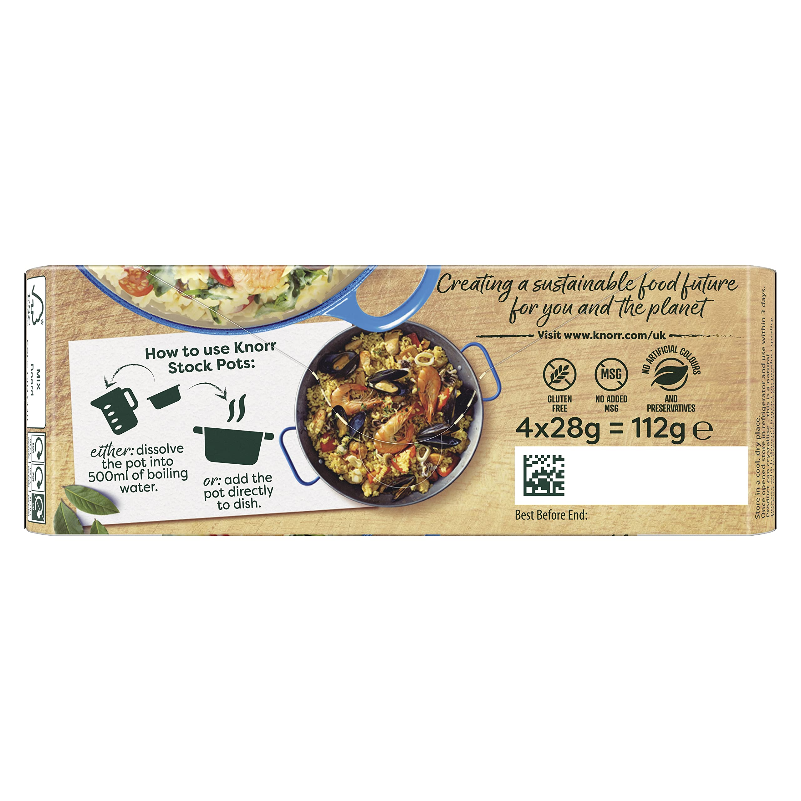
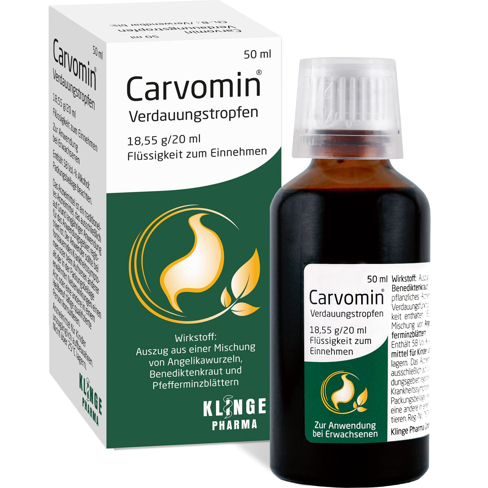
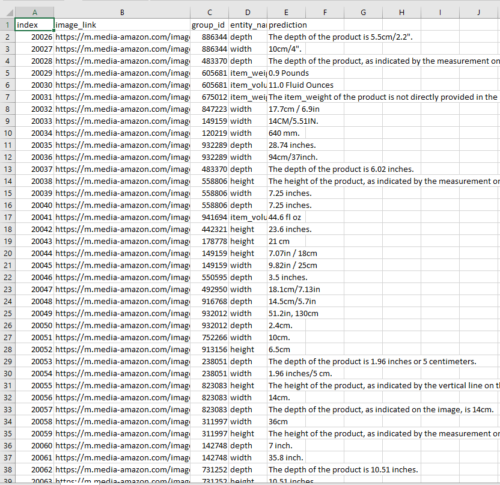
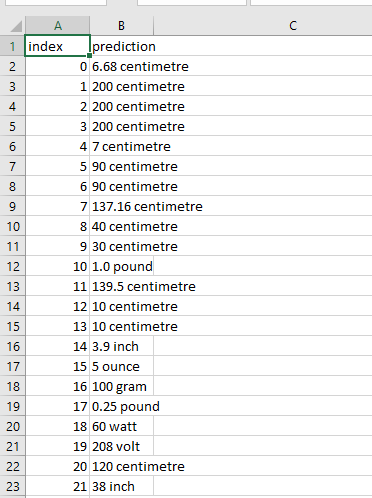

# Amazon ML Hackathon 2024

## Team: ML Mavericks
**Members:**
- Neel Shah (Email: neeldevenshah@gmail.com)
- Sneh Shah (Email: 22aiml049@charuat.edu.in)
- Harsh Maheshwari (Email: 22aiml019@charusat.edu.in)

### Overview
In the 2024 Amazon ML Hackathon, our team achieved an impressive rank of 64th out of over 75,000 participants from across India. Our project focused on **Feature Extraction from Images**, utilizing advanced machine learning techniques to extract critical product information directly from images. This capability is essential in fields such as healthcare and e-commerce.

### Project Description
Our solution leverages the **MiniCPM-Llama3-V-2.5** model, a cutting-edge vision-language model that integrates visual processing capabilities with natural language understanding. The system is designed to efficiently extract entity values, such as weight and dimensions, from product images.

### Key Features
- **Distributed Inference**: We conducted inference using over 15 GPUs, optimizing processing speed and scalability.
- **Kaggle GPU Support**: We are grateful to Kaggle for their generous GPU support, which was vital for our project's success.
- **Multilingual Support**: The model effectively processes both English and German texts.

### Code Structure
The main code folder contains two Jupyter Notebooks:
1. **Inference Notebook**: This notebook contains the logic for performing inference, including the starting and ending index for processing.
2. **Post-processing Notebook**: This notebook is used for refining the model's output and preparing it for submission.

### Methodology
1. **Data Preparation**: 
   - Image normalization and resizing.
   - Text extraction from image metadata.
2. **Model Implementation**: 
   - Used the MiniCPM-Llama3-V-2.5 model for extracting product attributes.
   - Implemented batch processing for efficient resource utilization.
3. **Post-processing Pipeline**:
   - Extracted numerical values and standardized units.
   - Handled edge cases and ensured precision.

### Results
- **Processing Speed**: Average time per image ranged from 2 to 3.5 seconds.
- **Scalability**: The distributed processing approach allowed efficient handling of large datasets.

### Image Samples
Here are some images related to our project:

#### Dataset Images

#### Output Comparison
**Mid-output (without post-processing):**

**Post-processed Output:**

### Challenges and Limitations
- **Resource Intensity**: The model's size may limit real-time application viability.
- **GPU Availability**: Dependency on Kaggle's resources could be a challenge for sustained use.

### Conclusion
Our implementation of the MiniCPM-Llama3-V-2.5 model, combined with a robust post-processing pipeline, has shown exceptional performance in extracting product attributes from images. This solution is poised to enhance automation in e-commerce and inventory management.

### License
This project is licensed under the MIT License. See the LICENSE file for details.

### Acknowledgments
Kaggle: For providing the GPU support necessary for our project's success.
Meta AI: For developing the Llama architecture that our model builds upon.

Feel free to replace the placeholder image paths with the actual file names of your images!